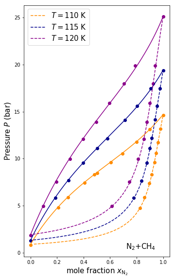

# A FORTRAN 2008 implementation of the PC-SAFT EoS

The Perturbed-Chain Statistical Associating Fluid Theory (hereafter **PC-SAFT**), equation of state ([Gross and Sadowski, 2001](https://doi.org/10.1021/ie0003887)) which is widely employed in the chemical engineering community. The PC-SAFT has been successfully introduced to the study of Titan by Tan *et al*. (2013, 2015) and Luspay-Kuti *et al*. (2015). The use of PC-SAFT is particularly relevant for the numerical simulation involving liquid-vapor equilibria and/or dissolution in the context of **Titan** (the main moon of the planet Saturn) "**hydrology**" (rain, rivers, lakes and seas of liquid hydrocarbons). This program has been entirely written in `FORTRAN 2008` by [**Daniel Cordier**](http://orcid.org/0000-0003-4515-6271) and its future developments are open to collaboration. The proposed implementation comes as a **`FORTRAN` `module`** which makes easy the reuse of the program and/or its use in a more extended/complex program.

**Two simple demo programs are provided (see below), the first one allows the user to compute the density of mixtures, the second simulates the isotherm binary diagram for a given mixture.**

The PC-SAFT implementation available here has been already use in the following works:

* Cordier, D., Cornet, T., Barnes, J. W., MacKenzie, S. M, Le Bahers, T., Nna Mvondo, D., Rannou, P., Ferreira, A. G., *Structure of Titan's evaporites*,
      2016, *Icarus*, 270, 41-56. [10.1016/j.icarus.2015.12.034](https://doi.org/10.1016/j.icarus.2015.12.034)
* Cordier, D., *How speed of sound measurements could bring constraints on the composition of Titan's seas*, 
      2016, *Monthly Notices of the Royal Astronomical Society*, 459, 2008-2013. [10.1093/mnras/stw732](https://doi.org/10.1093/mnras/stw732)
* Cordier, D., Garcia-Sanchez, F., Justo-Garcia, D. N., Liger-Belair, G., *Bubble streams in Titan's seas as product of liquid N_2-CH_4-C_2H_6 cryogenic mixture*,
       2017, *Nature Astronomy*, 1, 102. [10.1038/s41550-017-0102](https://doi.org/10.1038/s41550-017-0102)
* Singh, S., Combe, J.-P., Cordier, D., Chevrier, V.F., Wagner, A., McMahon, Z., *Experimental Determination of Acetylene and Ethylene Solubility in liquid Methane and Ethane: Implications to Titan's Surface*,
      2017, *Geochimica et Cosmochimica Acta*, 208, 86-101. [10.1016/j.gca.2017.03.007](https://doi.org/10.1016/j.gca.2017.03.007)
* Cordier, D., Liger-Belair, G., *Bubbles in Titan's seas: nucleation, growth and RADAR signature*,
      2018, *The Astrophysical Journal*, 859, 26. [10.3847/1538-4357/aabc10](https://doi.org/10.3847/1538-4357/aabc10)
* Cordier, D., & Carrasco, N., *The floatability of aerosols and waves damping on Titan's seas*,
       2019, *Nature Geoscience*, 12, 315-320. [10.1038/s41561-019-0344-4](https://doi.org/10.1038/s41561-019-0344-4)
* Cordier, D., Bonhommeau, D., Vu, T., Choukroun, M., Garcia-Sanchez, F. *Vertical compositional variations of liquid hydrocarbons in Titan's alkanofers*,
        2021, *A&A*, in press. Already available on Arxiv here: [https://arxiv.org/abs/2107.06348](https://arxiv.org/abs/2107.06348).

---
# How to cite this program

- Please refer to Cordier **Cordier *et al*. (2021)** mentioned above or **Cordier *et al*. (2017) [10.1038/s41550-017-0102](https://doi.org/10.1038/s41550-017-0102)**

---
# Quick start with Docker

For those who just want make a very quick test, the best solution is probably to run the programs in a tiny virtual machine which can be set up
using [Docker](https://www.docker.com) (see also the [Wikepedia page](https://en.wikipedia.org/wiki/Docker_(software))) which can be installed on your
computer by downloading the appropriate version [here](https://docs.docker.com/get-docker/) dedicated to your OS.

---
# How to get the files

There are two options:
- Click on the **`Code`** green button (top right of this web page) and download the ZIP archive.
- in a terminal type: `git clone https://github.com/dcordiercnrs/pcsaft-titan.git`

---
# Requirements

A easy use of the programs  available here requires:
 - a modern `FORTRAN` compiler like [**`gfortran` version 8.3.0**](https://gcc.gnu.org/wiki/GFortran)
 - the compilation tool [**`make`**](https://www.gnu.org/software/make/)
 - **optionally** the versioning tool [**`git`**](https://git-scm.com/)
 
---
# Files description

 + **Data files** found in the directory **'DATABASE_PCSAFT/'**:
   - **COMPOUNDS_DATA_PC-SAFT.data**: decribes the properties of the molecules which can be used by the program. The user can add a species just by adding a new line, species can be removed just by deleting lines or by adding a **#** at the beginning of the line.
   - **COMPOUNDS_DATA_PC-SAFT-PARAM_INTERAC.data**: provides the intraction parameters between species.
   - **COMPOUNDS_DATA_PC-SAFT_withASSO.data**: parameters for PC-SAFT version including association terms, not functional for the moment, present just for furture development.

 + **Data files** found in the directory **'DATA_EXPERIMENTAL/'**: experimental measurement to make comparison plots with PC-SAFT outputs.
   
 + **Main programs**
   - **pcsaft_demo.f08**: provides some example of PC-SAFT use.
   - **binary_N2CH4_demo.f08**: demo program to simulate a liquid-vapor equilibrium for the binary mixture N2-CH4.
 
 + **FORTRAN modules**
   - **utils_dc.f08**: contains general parameters and utilities
   - **foul.f90**: (*FOUL: The Fortran Output Library*) FORTRAN module written by Philipp Emanuel Weidmann provides a lot of cool and useful stuff like text outputs colorization, timer, etc.
   - **mod_pcsaft.f08**: the module providing PC-SAFT.

 + **Bonus**
   - **binaire_diag_N2CH4.ipynb**: a `Python Jupyter Notebook` to plot binary diagram, uses data in **DATA_EXPERIMENTAL/** and examples of simulation results stored in **BINARY_RESULTS_EXAMPLES/**. With this `notebook` the user can rebuild the binary diagram presented above in this webpage.
   - **Dockerfile**: Docker configuration file, allow to build a small virtual Linux machine with all the required tools to compile and run the programs available in this repository. 
   
---
# Compilation

+ Edit the **Makefile** an specify your FORTRAN compiler and required options, the present code has been compiled with the GNU compiler [**`gfortran` version 8.3.0**](https://gcc.gnu.org/wiki/GFortran) using the [Debian Buster OS  ](https://www.debian.org/releases/buster/) 
+ in the terminal just type **make** and you should get two executable files respectively called **pcsaft_demo** and **binary_N2CH4_demo**
+ in the terminal type **./pcsaft_demo** to run the demo program.
+ in the terminal type **./binary_N2CH4_demo** to run the N2-CH4 liquid-vapor simulation program.

---
# Examples

+ Computation of mixtures density with **pcsaft_demo.f08**:
  - compile the programs with `make`
  - run the program `./pcsaft_demo`
  - read the results in the standard outputs.
  - parameter values can be changed in the source code itself.
  
+ Simulations of a liquid-vapor equilibrium for the binary system N2-CH4 under cryogenic conditions with **binary_N2CH4_demo.f08**:
  - compile the programs with `make`
  - run the program `./binary_N2CH4_demo`
  - results are under the form of two ASCII text files **binary_diag_N2CH4_L.dat** (for the liquid phase) and **binary_diag_N2CH4_v.dat** (for the vapor phase)
  - **Comments**:
    - parameters, like temperature of the system, can be changed in the source code itself.
    - PC-SAFT parameters can be adjusted in data files contained in the directory **DATABASE_PCSAFT/**
    - results produced by this program can be compared to laboratory measurements available under the form of text files in the directory **DATA_EXPERIMENTAL/**
    
---
# How to add new species or remove species

To add a new species is relatively simple, a 2 steps procedure has to be followed:
  1. add a new line in the file **`DATABASE_PCSAFT/COMPOUNDS_DATA_PC-SAFT.data`**
  2. add corresponding new lines (more than just one should be required if the user wants to consider the interactions of the added species with many other species, in the file **`DATABASE_PCSAFT/COMPOUNDS_DATA_PC-SAFT-PARAM_INTERAC.data`**

To remove a species (useful only if one wants to test a new set of parameters, the line of standard value is put in comment by writting a "#" at the beginning of the line) needs only to comment the line with a "#"

